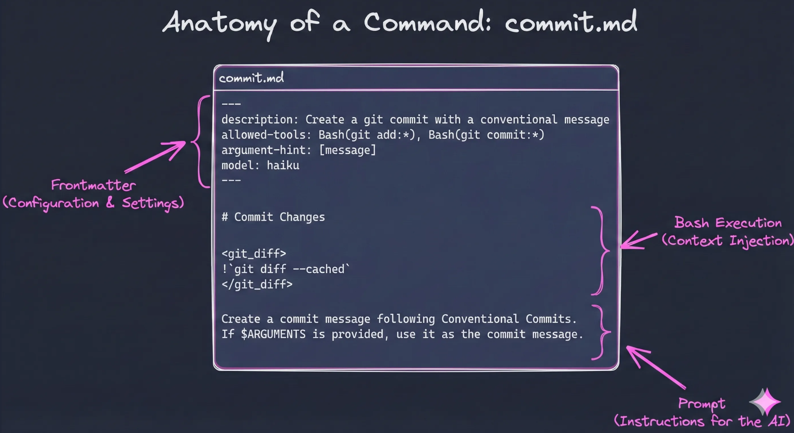

# Section 4: Slash Commands

Turn repetitive prompts into reusable one-word commands. And give LLM pre injected context to help it perform the task.

---

## What Are Slash Commands?

Slash commands are shortcuts for prompts you use often. Instead of typing the same instructions repeatedly, you save them once and invoke them with `/command-name`.

**Think of them like:**

- Shell aliases for your AI workflow
- Saved prompts that your whole team can share
- Standardized workflows that run the same way every time

## Where Do Commands Live?

| Location              | Scope                    | Use Case         |
| --------------------- | ------------------------ | ---------------- |
| `.claude/commands/`   | Project (shared via git) | Team workflows   |
| `~/.claude/commands/` | Personal (all projects)  | Your preferences |

---

## Experience the Problem

Let's feel the pain. Make a few small changes to a few diff files

### Attempt 1: The lazy prompt

```text
commit my changes
```

### Attempt 2: The full prompt (every. single. time.)

```text
Look at my staged changes and write a conventional commit message.

Use this format:
type(scope): subject

Types: feat, fix, docs, style, refactor, test, chore

Keep the subject under 50 characters, imperative mood. Do not mention anything todo with claude or ai.
```

**Notice:** This works - but you just typed a paragraph for a one-line commit message.

### The Real Pain

- [ ] You typed a paragraph just to get a one-line commit message
- [ ] Tomorrow you'll forget the exact format and type something slightly different
- [ ] Your teammate uses a different prompt and gets different results
- [ ] None of this is in version control

---

## Create Your First Command

Now let's save that prompt as a reusable command.

### Step 1: Create the directory

```bash
mkdir -p .claude/commands
```

### Step 2: Create a basic command file

Create `.claude/commands/commit.md`:

```markdown
---
description: Generate a commit message for staged changes
---

Look at my staged changes and write a conventional commit message.

Use this format:
type(scope): subject

Types: feat, fix, docs, style, refactor, test, chore

Keep the subject under 50 characters, imperative mood. Do not mention anything todo with claude or ai.
```

### Step 3: Test the basic version

```text
/commit
```

It works - Claude can still run `git diff` via tool calls if it decides to. But behavior varies, and you're spending extra reasoning steps and tool calls each time.

---

## Level Up: Dynamic Commands

Commands become powerful when they inject **real data**:

| Syntax       | What It Does        | Example              |
| ------------ | ------------------- | -------------------- |
| `!command`   | Inject shell output | `!git diff --staged` |
| `$ARGUMENTS` | Capture user input  | `/deploy $ARGUMENTS` |

### Step 4: Upgrade your command

Replace `.claude/commands/commit.md` with:

````markdown
---
description: Create a conventional commit message and commit staged changes
allowed-tools: Bash(git diff), Bash(git log), Bash(git add), Bash(git commit), Bash(git status)
model: claude-haiku-4-5-20251001
---

# Conventional Commit Context

- shows working tree state (staged, unstaged, untracked files)
  <git_status>
  !`git status`
  </git_status>

- shows the actual staged changes (what will be committed)
  <staged_diff>
  !`git diff --cached`
  </staged_diff>

- shows the actual unstaged changes (what is not staged for commit)
  <unstaged_diff>
  !`git diff`
  </unstaged_diff>

- shows the recent commits (last 5 commits,to match style/conventions)
  <recent_commits>
  !`git log --oneline -5`
  </recent_commits>

## Instructions

Review the changes above and commit using conventional commit format:

```text
<type>(<scope>): <description>
```

Types: `feat`, `fix`, `docs`, `style`, `refactor`, `perf`, `test`, `build`, `ci`, `chore`

Scope: Use folder/feature name (e.g., `auth`, `api`, `ui`). Omit if change is broad.

For breaking changes, add \`\`!\`\` after type: `feat(api)!: remove deprecated endpoint`

If changes are unrelated, split into logical commits. Otherwise, one commit is fine.

NEVER EVER mention AI / Claude in the commit message. No need to announce code is co authored by AI.

ALWAYS use one line commit message and be clear.

### Staging

- If changes are already staged, commit only what's staged
- If nothing is staged, review unstaged changes carefully before staging
- Avoid `git add -A` if sensitive files (.env, credentials) might be included

```bash
git commit -m "type(scope): description"
```
````

### Slash Command Anatomy

Let's break down the structure of a slash command:



| Section               | Purpose                                                                |
| --------------------- | ---------------------------------------------------------------------- |
| **Front matter**      | YAML metadata between `---` markers: description, allowed-tools, model |
| **Context Injection** | Shell output injected with `!` syntax before Claude sees the prompt    |
| **Instructions**      | The actual prompt Claude follows to complete the task                  |

> **Why Haiku?** You don't need a powerful model to write a commit message. By setting `model: claude-haiku-4-5-20251001` in the front matter, routine tasks run significantly faster and cheaper.

---

## Test the Smart Version

### 1. Make some changes to different files

```bash
# Edit a component, a doc, and maybe a config file
```

### 2. Run the upgraded command

```text
/commit
```

### 3. Notice what's different now

| Basic Command                                 | Smart Command                           |
| --------------------------------------------- | --------------------------------------- |
| Claude decides to run `git diff` (extra step) | Git state **pre-injected** instantly    |
| Behavior varies each run                      | **Predictable**, consistent results     |
| Generic commit format                         | **Your team's** conventions injected    |
| Uses tool calls (slower)                      | Context ready **before** Claude reasons |

---

## Command Features (Reference)

| Feature      | Syntax       | Example                                 |
| ------------ | ------------ | --------------------------------------- |
| Arguments    | `$ARGUMENTS` | `/fix-issue 123` → `$ARGUMENTS = "123"` |
| Positional   | `$1`, `$2`   | `/deploy prod v1.2` → `$1="prod"`       |
| Shell output | `!command`   | `!git status` injects output            |
| File content | `@file`      | `@package.json` injects file            |

---

## Example 2: PR Command

Here's another command that creates GitHub PRs with rich context injection and conditional logic.

Create `.claude/commands/pr.md`:

````markdown
---
description: Create a new GitHub PR with a well-formatted description
allowed-tools: Bash(git status), Bash(git branch), Bash(git log), Bash(git diff), Bash(git push),Bash(git pull), Bash(git rev-parse), Bash(gh pr create), Bash(gh pr view:*), Bash(gh pr edit), Bash(echo:*)
model: claude-haiku-4-5-20251001
---

# Create Pull Request Context

<current_branch>
!`git branch --show-current`
</current_branch>

<branch_status>
!`git status --short`
</branch_status>

<commits_on_branch>
!`git log main..HEAD --oneline`
</commits_on_branch>

<commit_details>
!`git log main..HEAD --pretty=format:"### %s%n%n%b%n---"`
</commit_details>

<full_diff_stat>
!`git diff main..HEAD --stat`
</full_diff_stat>

<files_changed>
!`git diff main..HEAD --name-only`
</files_changed>

<existing_pr>
!`gh pr view --json number,title,state,url --jq '"PR #\(.number): \(.title) [\(.state)]\nURL: \(.url)"' 2>/dev/null || echo "No PR exists for this branch"`
</existing_pr>

## Instructions

### Pre-checks

1. **Check for uncommitted changes** - if there are uncommitted changes, stop and ask the user to commit first. DO NOT try committing yourself. Your job is to create the PR. If we need to pull, just pull and then stop. DO NOT ASK FOLLOW UP QUESTIONS WHEN THERE ARE UNCOMMITTED CHANGES.
2. **Verify not on main** - if on main branch, stop and inform the user.
3. **Check if PR already exists** - if a PR exists, show the URL and ask if user wants to update it with `gh pr edit`.

### Step 1: Push the Branch

Push the branch to remote if needed:

```bash
git push -u origin $(git branch --show-current)
```

### Step 2: Create the PR

**Option A: Single commit branch** - use `--fill-first` to auto-fill from commit:

```bash
gh pr create --base main --fill-first
```

**Option B: Multi-commit branch** - craft a custom description using the format below:

```bash
gh pr create --base main --title "<title>" --body "$(cat <<'EOF'
<body>
EOF
)"
```

**Option C: Draft PR** - add `--draft` flag to create as draft:

```bash
gh pr create --base main --draft --title "<title>" --body "..."
```

## PR Format

### Title Format

Use conventional commit style:

```text
<type>(<scope>): <description>
```

**Types:** `feat`, `fix`, `docs`, `style`, `refactor`, `perf`, `test`, `build`, `ci`, `chore`

### Body Format

```markdown
## Summary

Brief 1-2 sentence description of what this PR does and why.

## Changes

- Bullet point list of specific changes
- Group related changes together
- Include file/module names when helpful

## Test Plan

- [ ] Manual testing steps or automated tests that verify the change
- [ ] Edge cases considered
```

### Step 3: Show Result

After creating the PR, display the URL with:

```bash
gh pr view --json url --jq '.url'
```
````

### What Makes This Command Powerful

| Feature               | How It's Used                                                     |
| --------------------- | ----------------------------------------------------------------- |
| **Rich context**      | Branch status, commits, diffs all pre-injected                    |
| **Conditional logic** | Instructions handle edge cases (uncommitted changes, existing PR) |
| **Tool restrictions** | `allowed-tools` limits to only git/gh commands needed             |
| **Cheaper model**     | Uses `claude-haiku` for cost efficiency on routine tasks          |

### Test It

```bash
# Make sure you're on a feature branch with commits
/pr
```

---

## Share Your Commands

With `/commit` and `/pr`, you've got two key pieces of your git workflow automated. Imagine building out the rest: `/branch`, `/push`, `/fix-pipeline`, `/lint`, `/vitest`...

Commands are just markdown files in `.claude/commands/` - commit them to your repo and your whole team gets the same workflows. Or share them across projects.

> **Coming Soon:** We're building a marketplace for sharable Claude Code configurations at [revity-claude-code-marketplace](https://github.com/revity-group/revity-claude-code-marketplace) - commands, hooks, and CLAUDE.md templates you can drop into any project.

---

## Built-in Commands Worth Knowing

Please refer [Claude Code documentation](https://code.claude.com/docs/en/slash-commands#built-in-slash-commands) for all available built-in commands.

| Command                   | What It Does                                                        |
| ------------------------- | ------------------------------------------------------------------- |
| `/clear`                  | Clear conversation history                                          |
| `/compact [instructions]` | Compact conversation with optional focus instructions               |
| `/config`                 | Open the Settings interface (Config tab)                            |
| `/context`                | Visualize current context usage as a colored grid                   |
| `/cost`                   | Show token usage statistics                                         |
| `/doctor`                 | Checks the health of your Claude Code installation                  |
| `/exit`                   | Exit the REPL                                                       |
| `/export [filename]`      | Export the current conversation to a file or clipboard              |
| `/help`                   | Get usage help                                                      |
| `/hooks`                  | Manage hook configurations for tool events                          |
| `/ide`                    | Manage IDE integrations and show status                             |
| `/init`                   | Initialize project with CLAUDE.md guide                             |
| `/install-github-app`     | Set up Claude GitHub Actions for a repository                       |
| `/mcp`                    | Manage MCP server connections and OAuth authentication              |
| `/memory`                 | Edit CLAUDE.md memory files                                         |
| `/model`                  | Select or change the AI model                                       |
| `/permissions`            | View or update permissions                                          |
| `/pr-comments`            | View pull request comments                                          |
| `/review`                 | Request code review                                                 |
| `/rewind`                 | Rewind the conversation and/or code                                 |
| `/security-review`        | Complete a security review of pending changes on the current branch |
| `/todos`                  | List current todo items                                             |

---

## Catch Up

```bash
git checkout workshop/section-4-commands
```

---

[← Back to CLAUDE.md](./3-claude-memory.md) | [Next: Hooks →](./5-hooks.md)
